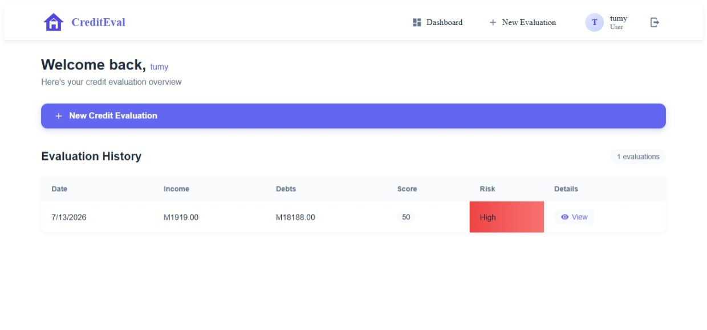
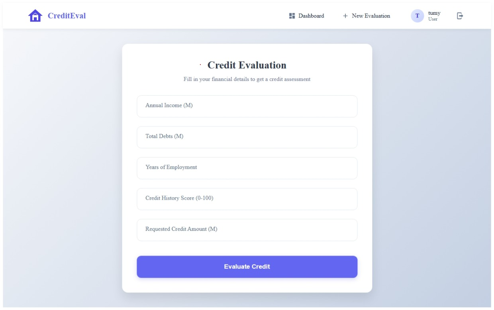
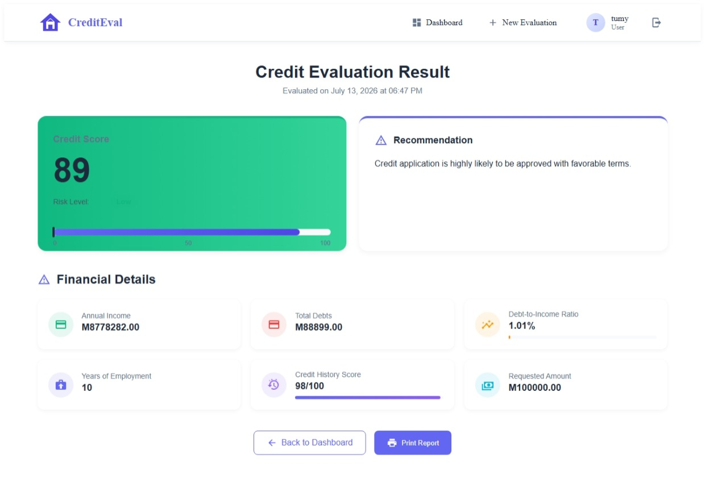
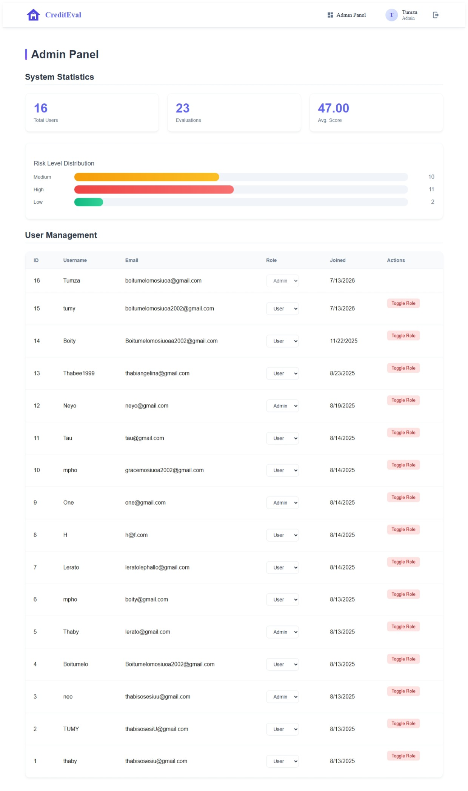

# Credit Evaluation Expert System

A full-stack **Credit Evaluation Expert System** designed to help users assess credit eligibility through financial analysis and automated risk evaluation. The system evaluates user financial information such as income, debts, employment history, credit history score, and requested credit amount to generate a credit score, risk level, and recommendation.

The platform provides a secure user portal where customers can perform credit evaluations and view previous assessments, while administrators can monitor system statistics and manage users.

---

# Live Demo

https://my-app-loansystem.vercel.app/

# GitHub Repository

Frontend:
https://github.com/Boitumelo-bit/my-app-loansystem

Backend:
https://github.com/Boitumelo-bit/my-app-backend.git

---

# About The Project

The Credit Evaluation Expert System is a modern full-stack web application built to automate the credit assessment process.

Traditional credit evaluation requires manual financial analysis, which can be time-consuming and inconsistent. This system provides an automated scoring mechanism that evaluates financial indicators and generates an assessment result.

The application calculates a credit score based on:

* Income level
* Debt-to-income ratio
* Employment stability
* Credit history score
* Requested credit amount

Based on the calculated score, the system determines:

* Credit score
* Risk level
* Approval recommendation

The project follows a client-server architecture using React.js for the frontend, Node.js and Express.js for the backend, and PostgreSQL for data storage.

---

# Key Highlights

* Full-stack web application
* Responsive user interface
* Secure authentication system
* JWT-based authorization
* Role-based access control
* Credit evaluation engine
* Automated credit scoring
* Risk classification
* Evaluation history tracking
* Admin dashboard
* User management
* Statistics dashboard
* PostgreSQL database
* RESTful API
* Secure password hashing
* Protected routes

---

# Features

## User Features

* User registration
* Secure login
* User authentication
* Personal dashboard
* Submit credit evaluation
* View credit history
* View evaluation results
* Financial analysis
* Credit score visualization
* Risk assessment
* Recommendations
* Print evaluation reports

---

## Credit Evaluation Features

The system evaluates financial information including:

* Annual income
* Total debts
* Years of employment
* Credit history score
* Requested credit amount

The evaluation engine calculates:

### Debt-to-Income Score

Measures the user's debt compared to income.

Lower debt ratios produce better scores.

### Employment Score

Longer employment periods improve credit stability.

### Credit History Score

Uses the user's credit history rating.

### Requested Amount Score

Evaluates whether the requested amount is reasonable compared to income.

The final credit score is calculated using a weighted scoring algorithm.

---

## Risk Classification

The system categorizes users into three risk levels:

### Low Risk

Credit application is highly likely to be approved with favorable terms.

### Medium Risk

Credit application may be approved with standard terms.

### High Risk

Credit approval is unlikely. Users are advised to improve their financial position.

---

# Administrator Features

Administrators have access to:

* Admin dashboard
* User management
* User statistics
* Evaluation statistics
* Average credit score monitoring
* Risk distribution analysis
* User role management

---

# Technology Stack

## Frontend

* React.js
* React Router
* Axios
* CSS3
* React Hooks
* Local Storage Authentication

---

## Backend

* Node.js
* Express.js
* JWT Authentication
* bcrypt.js
* PostgreSQL
* REST API
* Middleware Authentication

---

## Database

* PostgreSQL
* Neon Database

Database tables include:

* Users
* Credit Inputs
* Credit Results

---

# System Architecture

The application follows a three-tier architecture.

## Presentation Layer

Built with:

* React.js
* React Router
* Responsive Components
* CSS Styling

Responsible for:

* User interface
* Forms
* Dashboards
* Results visualization

---

## Business Logic Layer

Built with:

* Node.js
* Express.js

Responsible for:

* Authentication
* Credit score calculations
* User management
* API processing

---

## Data Layer

Built with:

* PostgreSQL

Responsible for:

* User storage
* Credit evaluation records
* Result storage

---

# User Roles

The system supports two roles:

## Standard User

Can:

* Register
* Login
* Perform credit evaluations
* View evaluation history
* View results

## Administrator

Can:

* Access admin dashboard
* View users
* Monitor system statistics
* Change user roles

---

# Authentication and Security

Security features include:

* JWT authentication
* Password hashing using bcrypt
* Protected API routes
* Role-based authorization
* Secure database queries
* Authentication middleware

---

# API Endpoints

## Authentication

```
POST /api/register

POST /api/login

GET /api/me
```

---

## Credit Evaluation

```
POST /api/credit-inputs

GET /api/credit-inputs

GET /api/credit-results/:inputId
```

---

## Administration

```
GET /api/admin/users

GET /api/admin/stats

PATCH /api/admin/users/:userId
```

---

# Database Design

## Users Table

Stores system users.

Fields:

* id
* username
* email
* password_hash
* role
* created_at

---

## Credit Inputs Table

Stores submitted financial information.

Fields:

* id
* user_id
* income
* debts
* employment_years
* credit_history_score
* requested_amount
* created_at

---

## Credit Results Table

Stores generated evaluation results.

Fields:

* id
* credit_input_id
* credit_score
* risk_level
* recommendation
* created_at

---

# Screenshots

## User Dashboard




## Credit Evaluation Form




## Credit Evaluation Results




## Admin Dashboard


# Installation and Setup

## Clone Frontend Repository

```
git clone https://github.com/Boitumelo-bit/my-app-loansystem.git
```

Navigate into the project:

```
cd my-app-loansystem
```

Install dependencies:

```
npm install
```

Create environment file:

```
REACT_APP_API_URL=http://localhost:5000/api
```

Start frontend:

```
npm start
```

---

# Backend Setup

Clone backend:

```
git clone https://github.com/Boitumelo-bit/my-app-backend.git
```

Navigate:

```
cd my-app-backend
```

Install dependencies:

```
npm install
```

Create `.env` file:

```
DATABASE_URL=your_postgresql_database_url

JWT_SECRET=your_secret_key

PORT=5000

NODE_ENV=development
```

Start backend:

```
npm run dev
```

---

# Deployment

## Frontend

Deployed using:

* Vercel

## Backend

Deployed using:

* Render

## Database

Hosted using:

* Neon PostgreSQL

---

# Future Improvements

Possible future enhancements:

* Machine learning credit prediction model
* Integration with banking APIs
* SMS notifications
* Email notifications
* PDF report generation
* Credit application workflow
* More advanced analytics dashboard
* Multi-factor authentication
* Mobile application version

---

# Developer

**Boitumelo Mosiuoa**

Diploma in Information Technology

Limkokwing University of Creative Technology

GitHub:

https://github.com/Boitumelo-bit

---

# License

This project was developed for educational and portfolio purposes.
